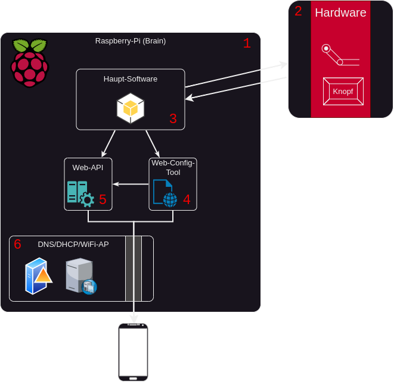
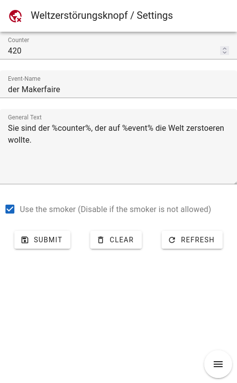
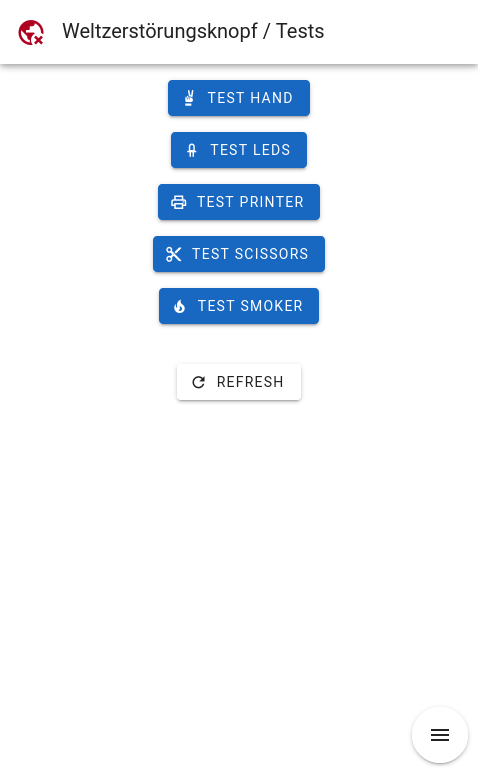
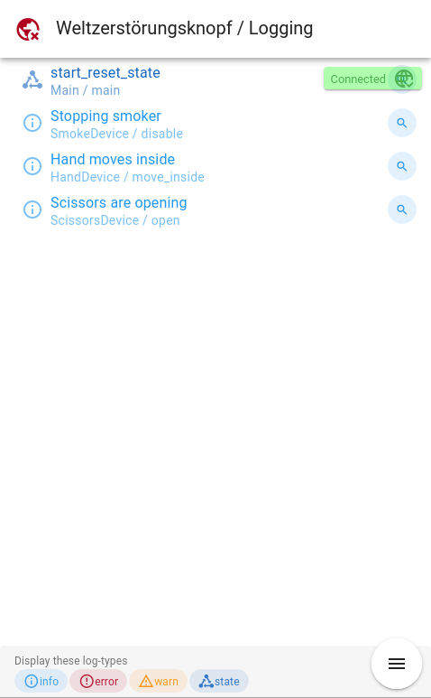

# Weltzerstörungsknopf
Der **Weltizerstörungsknopf**, kurz **Welti** ist ein Dauerprojekt von allen Mitgliedern des [ARTandTECH.space](artandtech.space).

# Repos
Einfachheitshalber ist hier einmal die Listung aller Repositorys, welche zum Projekt gehören:

|Name|Beschreibung|
|----|----------|
|[RPI-Software-Repo](https://github.com/artandtechspace/Weltzerstoerungsknopf-Software)|Python-Software, welche den Knopf steuert. Sozusagen das Gehirn.|
|[Configuration-Interface](https://github.com/artandtechspace/Weltzerstoerungsknopf-Configinterface)|Webapp, welche über die Python-Software ausgeliefert wird und zur Konfiguration dient.|

**Für die Software-Produkte liegt im jeweiligen Git-Repo selber eine Anteilung zum Aufsetzen der Debug/Develop Umgebung, daher wird dies hier vernachlässigt!**

# Übersicht
*Aktuell enthält dises Repository nur eine Dokumentation über den Aufbau, soll eines schönen Tages aber auch die Hardware-Dokumentation enthalten. Aber wie man sieht ist heute nicht dieser Tag.*

Eine Anleitung zum Aufsetzen einer neuen SD-Karte für einen RPi als Controller für den Welti findet man [hier](https://github.com/artandtechspace/Weltzerstoerungsknopf-Documentation/blob/main/Setup.md)

Folgendes Blockdiagram zeit das Zusammenspiel von Hardware & Software auf dem Raspberry pi (Brain):

Auf dem `Raspberry Pi (1)` laufen drei Anwendung:
- Hostapd `(6)`: Eine WiFi-Access-Point Software
- DNSMasq `(6)`: Ein DHCP und DNS-Server
- `Welti-Software (3)`: Das Python-Programm, welches den Welti steuert

Die `Welti-Software (3)` wurde in Python geschrieben und ist hautpsächlich für die Kommunikation mit der `Hardware (2)` zuständig, um die Funktionen des Welti zu gewährleiten.
Nebenbei läuft über die `Welti-Software (3)` auch noch eine `Webapi (5)` und ein `Webinterface (4)`, welches zum auslesen der Logs, Konfigurtionen und Tests des Welti genutzt wird.

Um dies zugänglich zu machen, öffnet der Welti mithilfe von `Hostapd (6)` ein eigenes Wifi, welches WPA2 gesichert ist. In dieses können sich die Administratoren dann einloggen. Durch `DNSMasq (6)` wird dann die Ip-Vergabe per DHCP geregelt und ein Captive-Portal suggeriert. Verbundene Geräte werden damit automatisch auf dieses Captive-Portal, welches die `Web-Config-Software (4)` ist weiterleitet.

# Sicherheit
Es wird davon ausgegagen, dass kein Physischer Zugriff zum Pi besteht, da im normalfall kein Bildschirm und keine Tastertur oä. angeschlossen sind. Daher besteht auch kein besonderer Schutz des Webinterfaces oder der API-Schnittstellen selber.
Die Sicherheit wird außschließlich durch das Passwort des Wifi's gewährleistet.

# Konfiguration
Die Konfiguration des Welti funktioniert wie zuvor erwähnt über ein seperates Wifi, vermutlich `ATS-Welti-Config`.
1. Logge dich zuerst in dieses ein und benutze das auf dem RPi konfigurierte Passwort.

Du solltest daraufhin (nach erfolgreichem verbinden mit dem Wifi) von deinem Gerät aufgefordert werden dich im Netzwerk anzumelden. Diesen Mechanismus benutzen wir um die Einstellungen des Welti zu ändern.
Sollte sich dieses nicht automatisch öffnen, verbinde dich bitte über einen Browser mit der Ip des Raspberry-Pi (Dein Gateway und insofern nicht bei der installation geändert 10.45.0.1).

2. Es öffnet sich das Web-Config-Tool des RPi auf welchem diese Konfiguriert werden kann.

Zum einen können hier die Einstellungen des Welti, wie der `Counter`, `Eventname` oder der `Druck-Text`, geändert werden:

zum anderen aber auch Hardware-Tests durchgeführt:

und die Logs des Welti in Echtzeit eingesehen werden:

